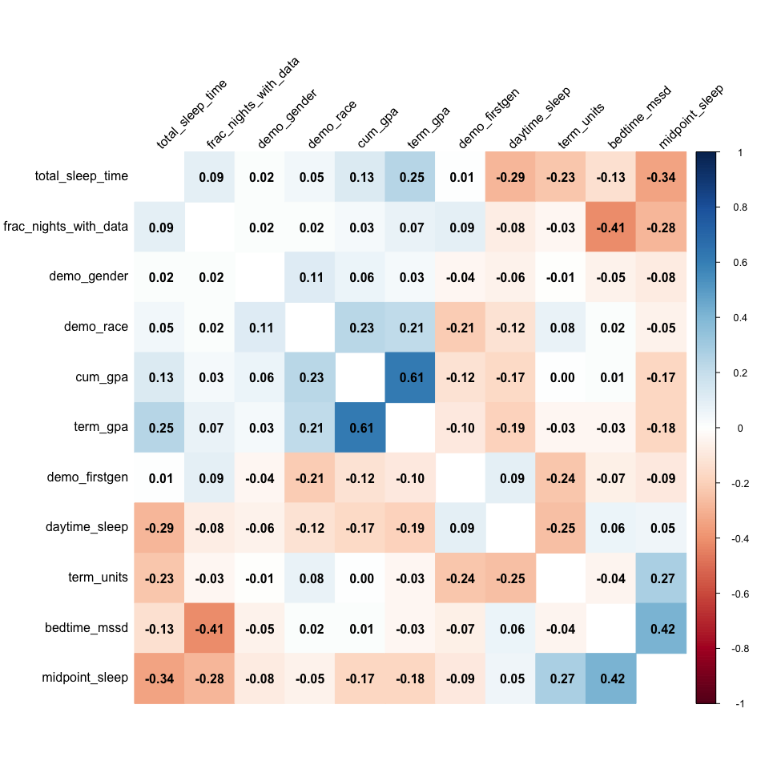
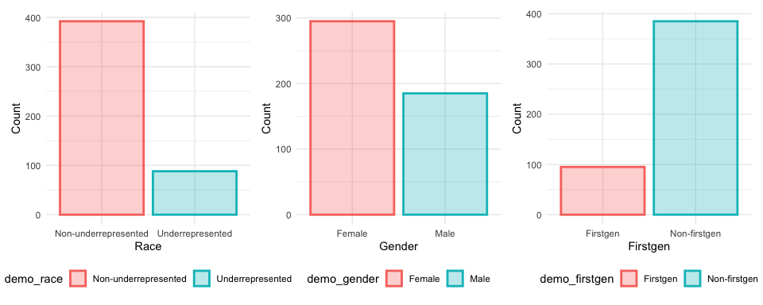
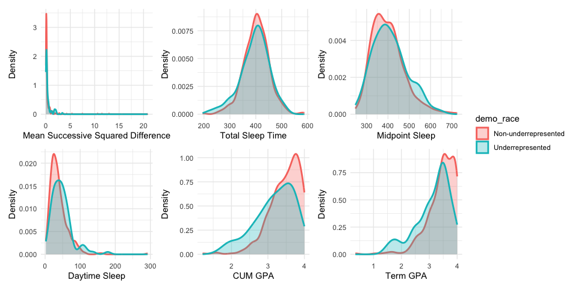
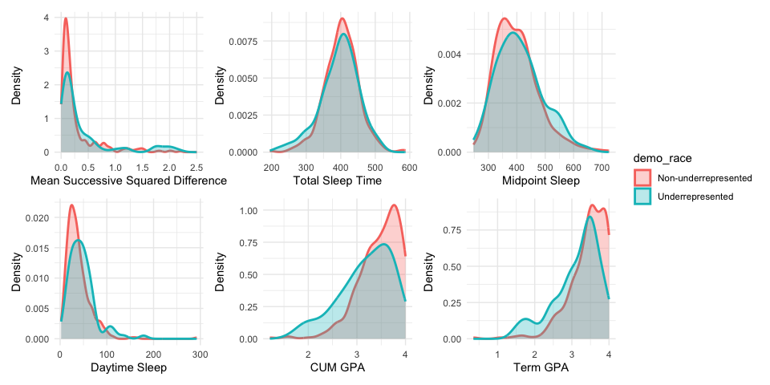

20241129_explore
================
Yuying Lu
2024-11-28

``` r
library(tidyverse)
theme_set(theme_minimal() + theme(legend.position = "bottom"))
```

``` r
df_cum =
  read_csv("data/cmu-sleep.csv") |> 
  janitor::clean_names() |> 
  drop_na()

df_cum
```

    ## # A tibble: 481 × 15
    ##    subject_id study cohort demo_race demo_gender demo_firstgen bedtime_mssd
    ##         <dbl> <dbl> <chr>      <dbl>       <dbl>         <dbl>        <dbl>
    ##  1        185     5 lac1           1           1             0       0.117 
    ##  2        158     5 lac1           0           1             0       0.142 
    ##  3        209     5 lac1           1           1             0       1.53  
    ##  4        102     5 lac1           0           1             1       0.130 
    ##  5        174     5 lac1           1           1             0       0.130 
    ##  6        184     5 lac1           1           1             0       0.209 
    ##  7        255     5 lac1           1           1             0       0.675 
    ##  8        265     5 lac1           1           1             0       0.130 
    ##  9        343     5 lac1           1           0             0       1.48  
    ## 10        137     5 lac1           1           1             0       0.0850
    ## # ℹ 471 more rows
    ## # ℹ 8 more variables: total_sleep_time <dbl>, midpoint_sleep <dbl>,
    ## #   frac_nights_with_data <dbl>, daytime_sleep <dbl>, cum_gpa <dbl>,
    ## #   term_gpa <dbl>, term_units <dbl>, zterm_units_zof_z <dbl>

``` r
summary(df_cum)
```

    ##    subject_id        study         cohort            demo_race    
    ##  Min.   :  1.0   Min.   :1.00   Length:481         Min.   :0.000  
    ##  1st Qu.:152.0   1st Qu.:2.00   Class :character   1st Qu.:1.000  
    ##  Median :302.0   Median :3.00   Mode  :character   Median :1.000  
    ##  Mean   :289.9   Mean   :2.94                      Mean   :0.817  
    ##  3rd Qu.:418.0   3rd Qu.:5.00                      3rd Qu.:1.000  
    ##  Max.   :671.0   Max.   :5.00                      Max.   :1.000  
    ##   demo_gender     demo_firstgen     bedtime_mssd       total_sleep_time
    ##  Min.   :0.0000   Min.   :0.0000   Min.   : 0.004505   Min.   :194.8   
    ##  1st Qu.:0.0000   1st Qu.:0.0000   1st Qu.: 0.075134   1st Qu.:370.5   
    ##  Median :1.0000   Median :0.0000   Median : 0.142840   Median :402.9   
    ##  Mean   :0.6133   Mean   :0.2017   Mean   : 0.478967   Mean   :400.9   
    ##  3rd Qu.:1.0000   3rd Qu.:0.0000   3rd Qu.: 0.324523   3rd Qu.:433.1   
    ##  Max.   :1.0000   Max.   :2.0000   Max.   :20.849225   Max.   :587.7   
    ##  midpoint_sleep  frac_nights_with_data daytime_sleep        cum_gpa     
    ##  Min.   :247.1   Min.   :0.2143        Min.   :  2.269   Min.   :1.210  
    ##  1st Qu.:345.0   1st Qu.:0.7931        1st Qu.: 22.385   1st Qu.:3.160  
    ##  Median :393.1   Median :0.9310        Median : 34.679   Median :3.500  
    ##  Mean   :401.9   Mean   :0.8603        Mean   : 40.059   Mean   :3.413  
    ##  3rd Qu.:442.7   3rd Qu.:1.0000        3rd Qu.: 50.889   3rd Qu.:3.770  
    ##  Max.   :724.7   Max.   :1.0000        Max.   :292.304   Max.   :4.000  
    ##     term_gpa       term_units    zterm_units_zof_z  
    ##  Min.   :0.350   Min.   : 5.00   Min.   :-3.982521  
    ##  1st Qu.:3.120   1st Qu.:15.00   1st Qu.:-0.604268  
    ##  Median :3.500   Median :17.00   Median : 0.041207  
    ##  Mean   :3.384   Mean   :29.42   Mean   :-0.000448  
    ##  3rd Qu.:3.790   3rd Qu.:48.00   3rd Qu.: 0.560271  
    ##  Max.   :4.000   Max.   :73.00   Max.   : 4.055295

``` r
df_cum =  df_cum |> 
  filter(demo_firstgen!=2) 

lm_fit = lm(cum_gpa ~ demo_race + demo_gender + demo_firstgen + bedtime_mssd + total_sleep_time + midpoint_sleep + daytime_sleep, data = df_cum)

summary(lm_fit)
```

    ## 
    ## Call:
    ## lm(formula = cum_gpa ~ demo_race + demo_gender + demo_firstgen + 
    ##     bedtime_mssd + total_sleep_time + midpoint_sleep + daytime_sleep, 
    ##     data = df_cum)
    ## 
    ## Residuals:
    ##      Min       1Q   Median       3Q      Max 
    ## -2.23465 -0.23279  0.07746  0.31652  0.86550 
    ## 
    ## Coefficients:
    ##                    Estimate Std. Error t value Pr(>|t|)    
    ## (Intercept)       3.6793826  0.2660297  13.831  < 2e-16 ***
    ## demo_race         0.2230181  0.0542572   4.110 4.66e-05 ***
    ## demo_gender       0.0196157  0.0420658   0.466 0.641208    
    ## demo_firstgen    -0.0961918  0.0524848  -1.833 0.067469 .  
    ## bedtime_mssd      0.0323590  0.0153668   2.106 0.035751 *  
    ## total_sleep_time  0.0002729  0.0004463   0.612 0.541095    
    ## midpoint_sleep   -0.0011921  0.0003078  -3.873 0.000123 ***
    ## daytime_sleep    -0.0021778  0.0007927  -2.747 0.006240 ** 
    ## ---
    ## Signif. codes:  0 '***' 0.001 '**' 0.01 '*' 0.05 '.' 0.1 ' ' 1
    ## 
    ## Residual standard error: 0.4437 on 472 degrees of freedom
    ## Multiple R-squared:  0.115,  Adjusted R-squared:  0.1019 
    ## F-statistic: 8.765 on 7 and 472 DF,  p-value: 3.804e-10

``` r
boot_straps = 
  df_cum|> 
  modelr::bootstrap(1000) |> 
  mutate(
    strap = map(strap, as.tibble),
    models = map(strap, \(df) lm(cum_gpa ~ demo_race + demo_gender + demo_firstgen + bedtime_mssd + total_sleep_time + midpoint_sleep + daytime_sleep, data = df)),
    results = map(models, broom::tidy)
  ) |> 
  select(.id, results) |> 
  unnest(results)

boot_straps |> 
  group_by(term) |> 
  summarise(
    boot_est = mean(estimate),
    boot_se = sd(estimate),
    boot_ci_ll = quantile(estimate, .025),
    boot_ci_ul = quantile(estimate, .975),
  )
```

    ## # A tibble: 8 × 5
    ##   term              boot_est  boot_se boot_ci_ll boot_ci_ul
    ##   <chr>                <dbl>    <dbl>      <dbl>      <dbl>
    ## 1 (Intercept)       3.66     0.271      3.13       4.18    
    ## 2 bedtime_mssd      0.0310   0.0127     0.00250    0.0540  
    ## 3 daytime_sleep    -0.00217  0.000729  -0.00362   -0.000787
    ## 4 demo_firstgen    -0.0937   0.0499    -0.192      0.00215 
    ## 5 demo_gender       0.0215   0.0425    -0.0648     0.101   
    ## 6 demo_race         0.226    0.0632     0.0998     0.345   
    ## 7 midpoint_sleep   -0.00117  0.000322  -0.00180   -0.000580
    ## 8 total_sleep_time  0.000279 0.000452  -0.000587   0.00114

# Visualization

``` r
library(corrplot)

cor_matrix <- cor(df_cum[4:14])

corrplot(cor_matrix,  method = "color", 
         addCoef.col = "black", 
         tl.col = "black",      
         tl.srt = 45,
         order = 'hclust',
         diag = F)          
```

<!-- -->

``` r
plot_df = df_cum |> 
  mutate(demo_race = case_match(demo_race,
                                   0 ~ "Underrepresented",
                                   1~ "Non-underrepresented"),
         demo_race = factor(demo_race),
         demo_gender = case_match(demo_gender,
                                   0 ~ "Male",
                                   1~ "Female"),
         demo_gender = factor(demo_gender),
         demo_firstgen = case_match(demo_firstgen,
                                   0 ~ "Non-firstgen",
                                   1~ "Firstgen"),
         demo_firstgen = factor(demo_firstgen)
         ) 


# Process data: Rename and calculate proportions
plot_race = 
  plot_df |>  
  group_by(demo_race) |> 
  ggplot(aes(x = demo_race, fill = demo_race, color = demo_race)) +
  geom_bar(position = "dodge" ,alpha = 0.3, linewidth = 1) +
  labs(x = "Race", y = "Count") +
  theme_minimal() +
  theme(
    strip.text = element_text(size = 14),
    plot.title = element_text(size = 16, face = "bold", hjust = 0.5),
    legend.position = "bottom"
  )

# Process data: Rename and calculate proportions
plot_gender = 
  plot_df |>  
  group_by(demo_gender) |> 
  ggplot(aes(x = demo_gender, fill = demo_gender, color = demo_gender)) +
  geom_bar(position = "dodge" ,alpha = 0.3, linewidth = 1) +
  labs(x = "Gender", y = "Count") +
  theme_minimal() +
  theme(
    strip.text = element_text(size = 14),
    plot.title = element_text(size = 16, face = "bold", hjust = 0.5),
    legend.position = "bottom"
  )

plot_firstgen = 
  plot_df |>  
  group_by(demo_firstgen) |> 
  ggplot(aes(x = demo_firstgen, fill = demo_firstgen, color = demo_firstgen)) +
  geom_bar(position = "dodge" ,alpha = 0.3, linewidth = 1) +
  labs(x = "Firstgen", y = "Count") +
  theme_minimal() +
  theme(
    strip.text = element_text(size = 14),
    plot.title = element_text(size = 16, face = "bold", hjust = 0.5),
    legend.position = "bottom")

library(patchwork)

plot_race + plot_gender + plot_firstgen + plot_layout(nrow =1) 
```

<!-- -->

``` r
# Mean successive squared difference of bedtime.

plot_bedtime = plot_df |> 
  ggplot(aes(x = bedtime_mssd,fill = demo_race, color = demo_race)) +
  geom_density(alpha = 0.3, linewidth = 1) +
  labs(x = "Mean Successive Squared Difference", y = "Density") +
  theme_minimal() +
  theme(
    strip.text = element_text(size = 14),
    plot.title = element_text(size = 16, face = "bold", hjust = 0.5)
  )

plot_bedtime2 = plot_df |> 
  ggplot(aes(x = bedtime_mssd,fill = demo_race, color = demo_race)) +
  geom_density(alpha = 0.3, linewidth = 1) +
  labs(x = "Mean Successive Squared Difference", y = "Density") +
  xlim(c(0,2.5))+
  theme_minimal() +
  theme(
    strip.text = element_text(size = 14),
    plot.title = element_text(size = 16, face = "bold", hjust = 0.5)
  )

plot_totalsleep = plot_df |> 
  ggplot(aes(x = total_sleep_time ,fill = demo_race, color = demo_race)) +
  geom_density(alpha = 0.3, linewidth = 1) +
  labs(x = "Total Sleep Time", y = "Density") +
  theme_minimal() +
  theme(
    strip.text = element_text(size = 14),
    plot.title = element_text(size = 16, face = "bold", hjust = 0.5)
  )

plot_midpoint = plot_df |> 
  ggplot(aes(x = midpoint_sleep,fill = demo_race, color = demo_race)) +
  geom_density(alpha = 0.3, linewidth = 1) +
  labs(x = "Midpoint Sleep", y = "Density") +
  theme_minimal() +
  theme(
    strip.text = element_text(size = 14),
    plot.title = element_text(size = 16, face = "bold", hjust = 0.5)
  )

plot_daysleep = plot_df |> 
  ggplot(aes(x = daytime_sleep,fill = demo_race, color = demo_race)) +
  geom_density(alpha = 0.3, linewidth = 1) +
  labs(x = "Daytime Sleep", y = "Density") +
  theme_minimal() +
  theme(
    strip.text = element_text(size = 14),
    plot.title = element_text(size = 16, face = "bold", hjust = 0.5)
  )

plot_cumgpa = plot_df |> 
  ggplot(aes(x = cum_gpa,fill = demo_race, color = demo_race)) +
  geom_density(alpha = 0.3, linewidth = 1) +
  labs(x = "CUM GPA", y = "Density") +
  theme_minimal() +
  theme(
    strip.text = element_text(size = 14),
    plot.title = element_text(size = 16, face = "bold", hjust = 0.5)
  )

plot_termgpa = plot_df |> 
  ggplot(aes(x = term_gpa,fill = demo_race, color = demo_race)) +
  geom_density(alpha = 0.3, linewidth = 1) +
  labs(x = "Term GPA", y = "Density") +
  theme_minimal() +
  theme(
    strip.text = element_text(size = 14),
    plot.title = element_text(size = 16, face = "bold", hjust = 0.5)
  )
```

``` r
plot_bedtime + plot_totalsleep + plot_midpoint + plot_daysleep + plot_cumgpa + plot_termgpa + plot_layout(ncol = 3,guides = "collect") & theme(legend.position = "right") 
```

<!-- -->

``` r
plot_bedtime2 + plot_totalsleep + plot_midpoint + plot_daysleep + plot_cumgpa + plot_termgpa + plot_layout(ncol = 3,guides = "collect" ) & theme(legend.position = "right")         
```

<!-- -->
