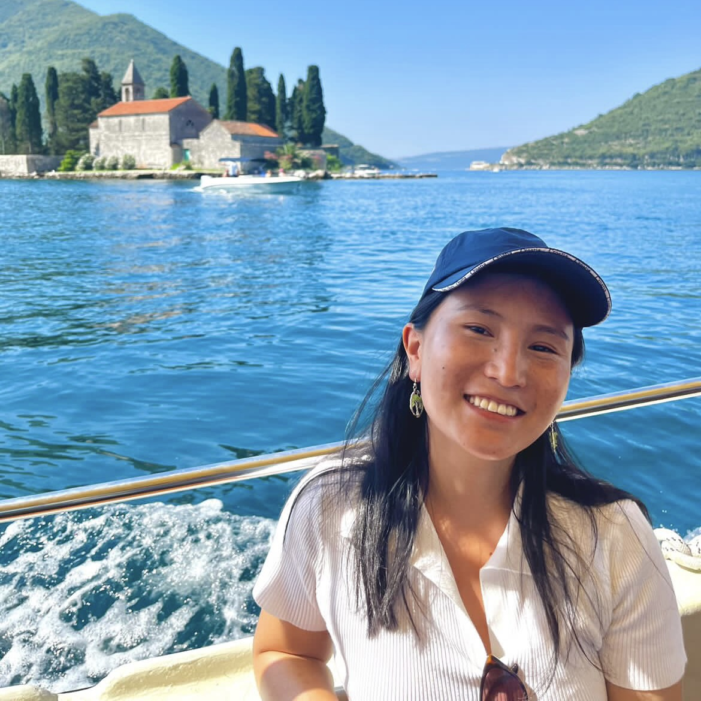

We are all first-year PhD students in Biostatistics at the Columbia Mailman School of Public Health. Feel free to check out our other work!

```{css, echo = FALSE}

img.portrait{
  width:45%;
  float:right;
}

```

<table style="width:90%">
  <tr>
    <td><h4></h4></td>
    <td></td>
  </tr>
  <tr>
    <td>
    <h4> Kate Colvin<br />
    [`r shiny::icon("github")`](https://github.com/kaaateco)
    [`r shiny::icon("linkedin")`](https://www.linkedin.com/in/kacolvin/)
    [`r shiny::icon("envelope")`](mailto:<kac2301@cumc.columbia.edu>)</h4></td>
    <td></td>
    
  </tr>
  <tr>
    <td><h3></h3></td>
    <td></td>
  </tr>
  <tr>
    <td>
    <h4> Yuying Lu <br />
    [`r shiny::icon("github")`](https://github.com/YUYING-LU)
    [`r shiny::icon("linkedin")`](https://www.linkedin.com/in/yuying-lu-584035284/?locale=en_US/)
    [`r shiny::icon("envelope")`](mailto:<yl5839@cumc.columbia.edu>)</h4></td>
    <td></td>
  </tr>
  
  <tr>
    <td><h3></h3></td>
    <td></td>
  </tr>
  <tr>
    <td>
    <h4> Chhiring Lama <br />
    [`r shiny::icon("github")`](https://github.com/Chhiring-Lama)
    [`r shiny::icon("linkedin")`](https://www.linkedin.com/in/chhiring-lama/)
    [`r shiny::icon("envelope")`](mailto:<cyl2159@cumc.columbia.com>)</h4></td>
    <td></td>
  </tr>
</table>
